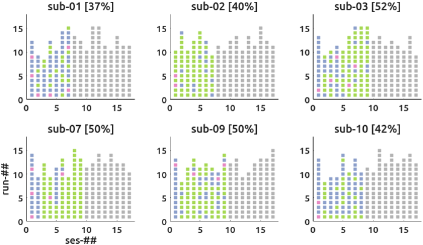
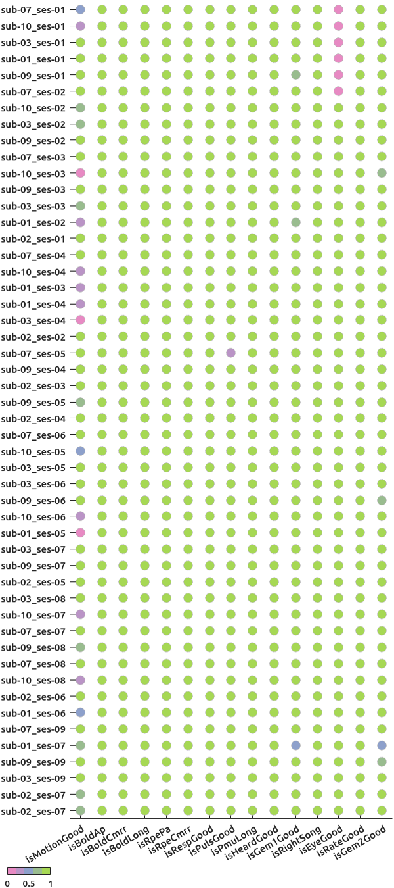
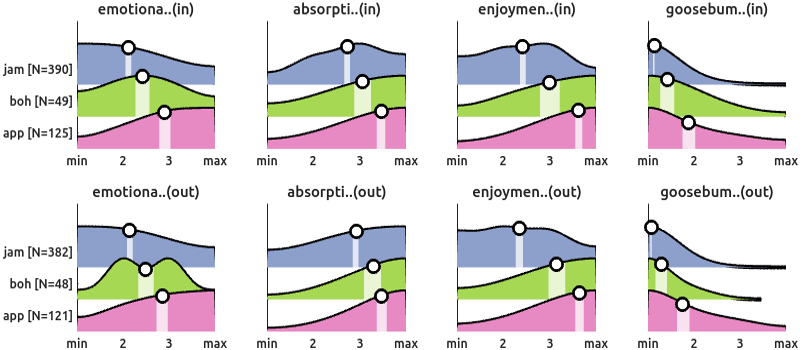

# Overview of the current progress
Here, the current (06-Aug-2026 00:45:34 `Europe/Berlin`) progress of the fMRI+ data acquisition of the [ManyMusic](https://manymusic.net/) project is shared. Please direct any questions to [Dr. Seung-Goo Kim](mailto:seung-goo.kim@ae.mpg.de).

## Current acquisition

 <small>Each box represents a run. *GREY*: Yet to be done. *RED*: With major issues like a wrong song was played or a wrong MR sequence was used. Needs to be rerun. *BLUE*: With minor issues like the flatlined EyeLink or headmotion>1mm. No need to rerun? *GREEN*: All good (but possibly with "normal" artefacts.</small>

## Goddness grid

 <small>fdMax: framewise displacement max (mm). fdMed: FD median. fdStd: FD standard deviation. resp: respiration belt. puls: pulse-oximeter. var: variance. in-gems: in-scanner-GEMS. pupil: in-scanner EyeLink pupil. liking: post-scanning liking rating. out-gems: post-scanning-GEMS.</small>

## Overall emotional responses

<small>Overall ratings pooled across all subjects. White bands mark 95%-confidence intervals. White circles mark arithmetic means (of ordinal variables! yes, I know). Top: in-scanner; Bottom: out-scaner. *jam*=Jamendo, *boh*=Bohemian, *app*=Apple. </small>

