# leaking runs: sub-01
### sub-01_ses-15_run-13
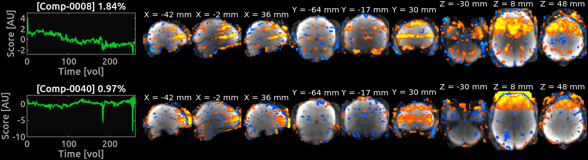

### sub-01_ses-15_run-10
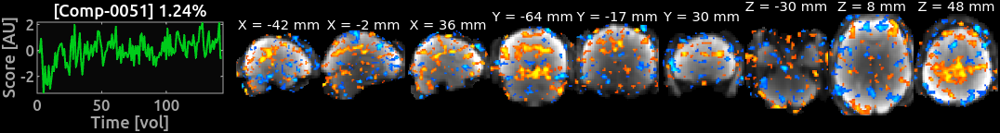

### sub-01_ses-15_run-08
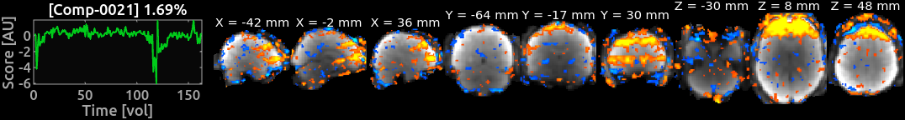

### sub-01_ses-15_run-07
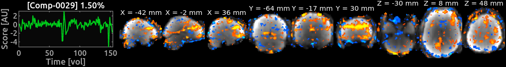

### sub-01_ses-15_run-06
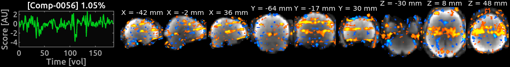

### sub-01_ses-15_run-04
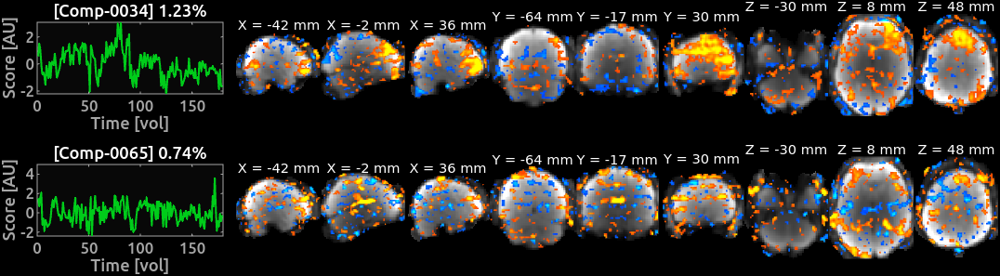

### sub-01_ses-15_run-02
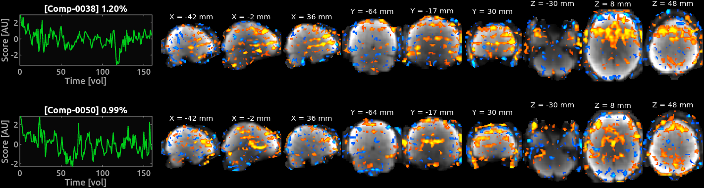

### sub-01_ses-14_rest-eyelink
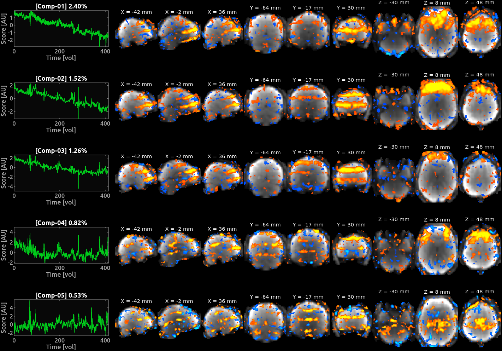

### sub-01_ses-12_rest-eyeclos
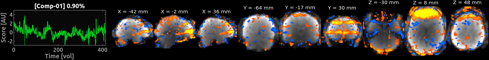

### sub-01_ses-10_rest-eyelink
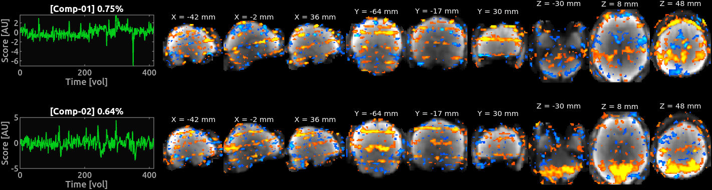

### sub-01_ses-08_rest-eyelink
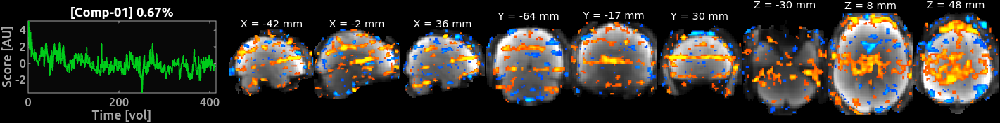

### sub-01_ses-06_rest-eyeclos
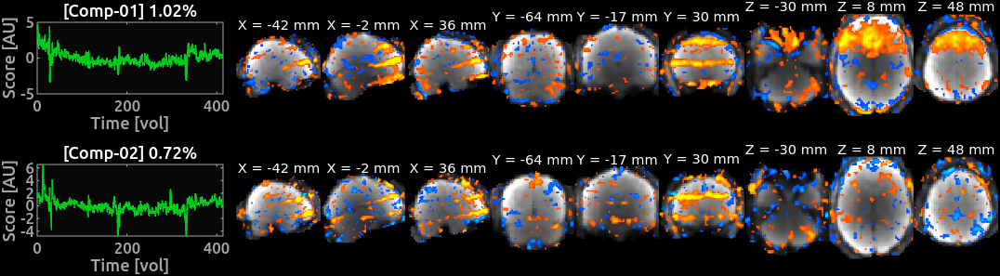

### sub-01_ses-02_run-09

### sub-01_ses-02_run-08

### sub-01_ses-02_run-02

