# leaking sessions: sub-03
### sub-03_ses-15_run-02
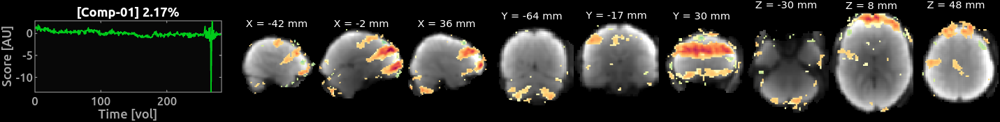

### sub-03_ses-14_run-10
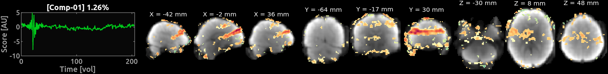

### sub-03_ses-14_run-07
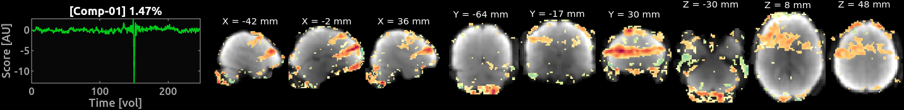

### sub-03_ses-14_run-05
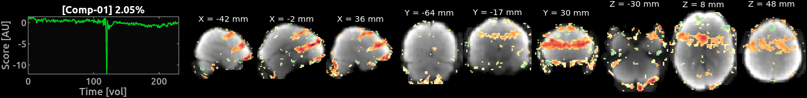

### sub-03_ses-13_run-12
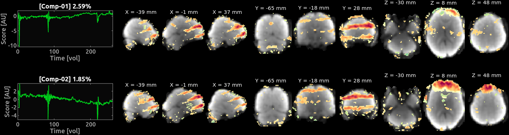

### sub-03_ses-13_run-10
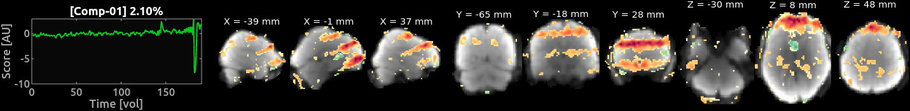

### sub-03_ses-13_run-09
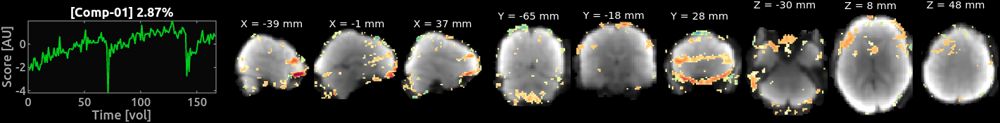

### sub-03_ses-13_run-08
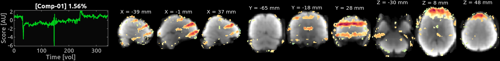

### sub-03_ses-13_run-01
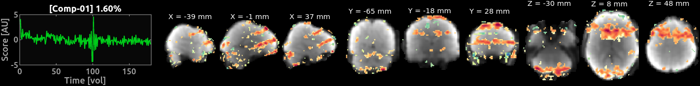

### sub-03_ses-12_run-03
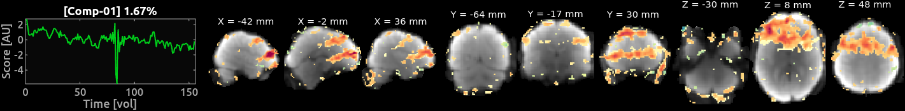

### sub-03_ses-11_run-13
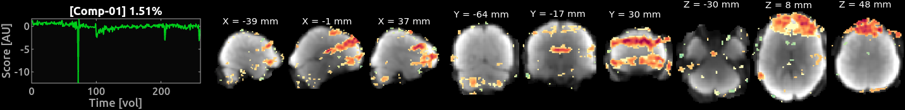

### sub-03_ses-11_run-10
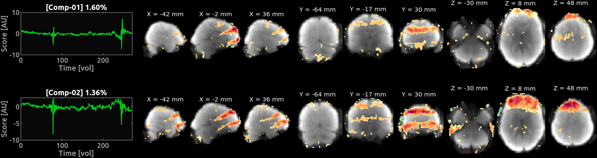

### sub-03_ses-11_run-04
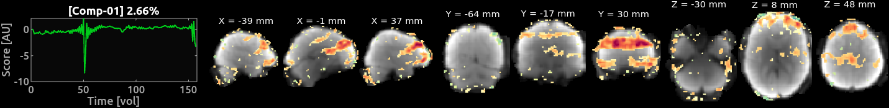

### sub-03_ses-11_run-02
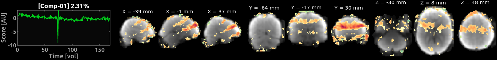

### sub-03_ses-09_run-14
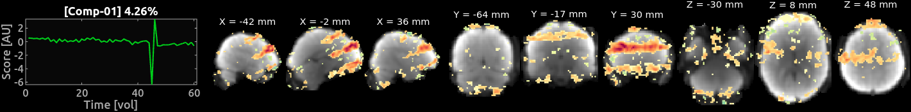

### sub-03_ses-09_run-10
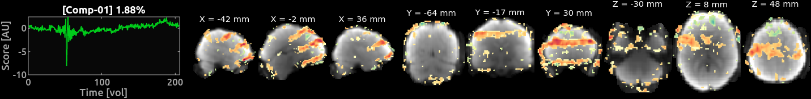

### sub-03_ses-09_run-04
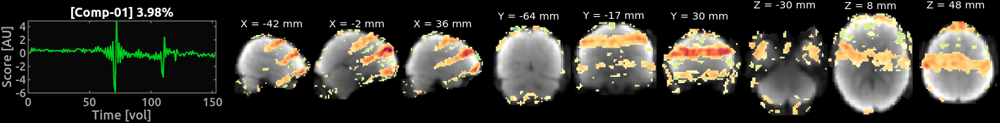

### sub-03_ses-09_run-01
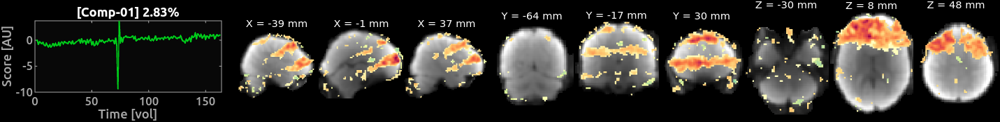

### sub-03_ses-08_run-15
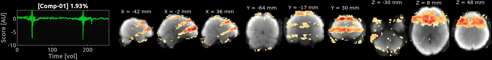

### sub-03_ses-08_run-06
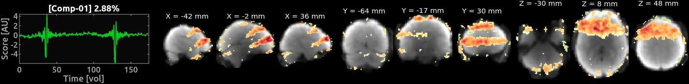

### sub-03_ses-05_run-02
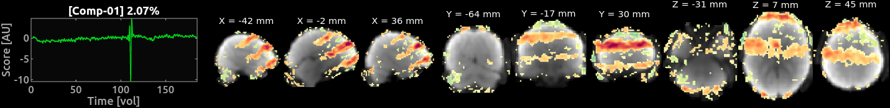

### sub-03_ses-04_run-06
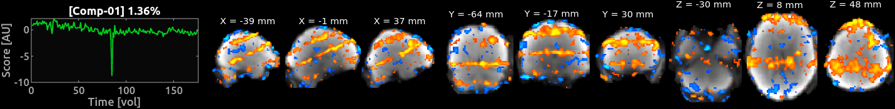

### sub-03_ses-04_run-04
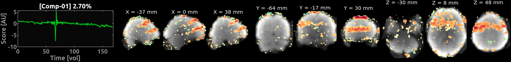

### sub-03_ses-03_run-10
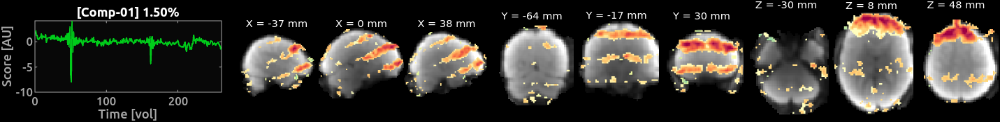

### sub-03_ses-03_run-09
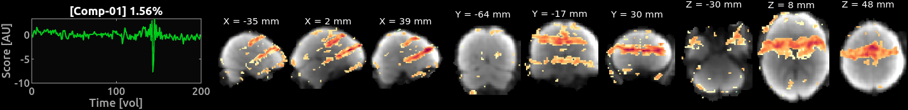

