# topup: sub-01
### 20260818T1203:sub-01_ses-11
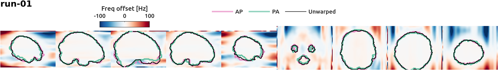

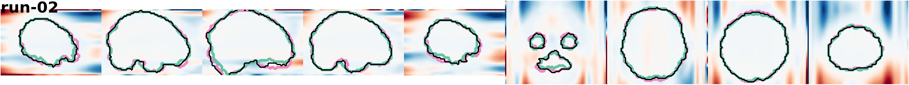

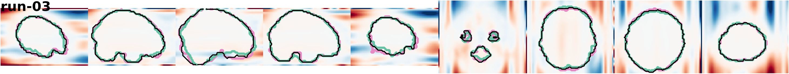

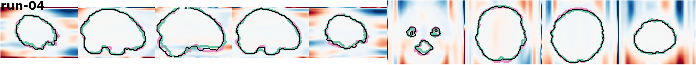

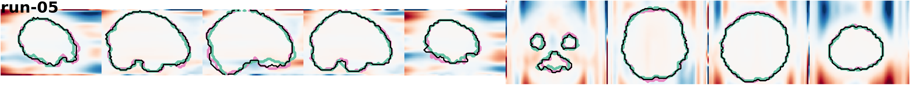

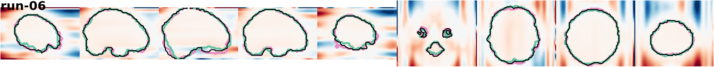

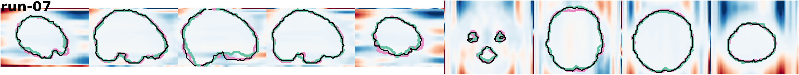

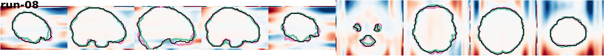

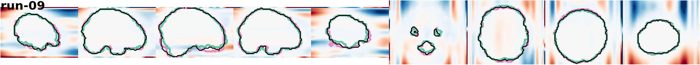

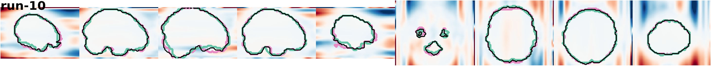

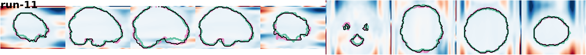

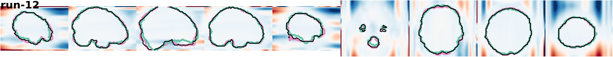

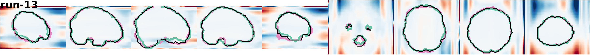

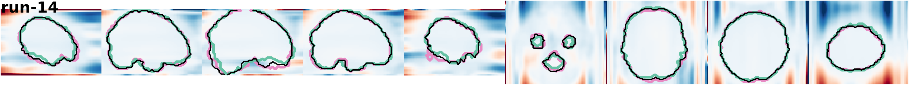

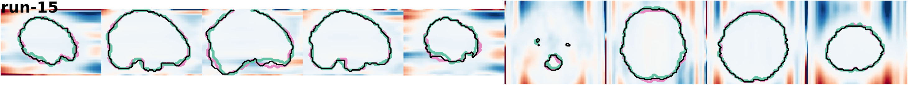

### 20260814T1600:sub-01_ses-10
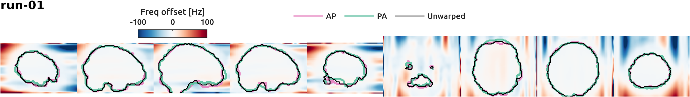

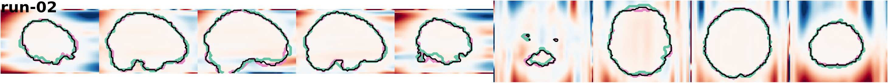

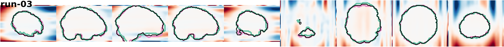

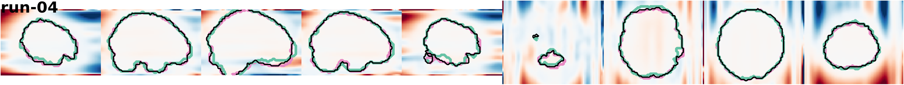

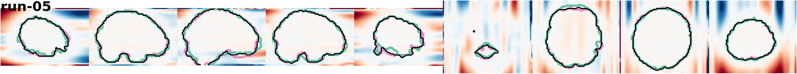

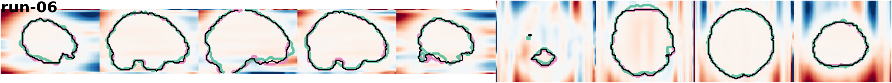

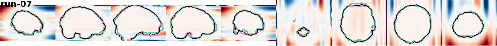

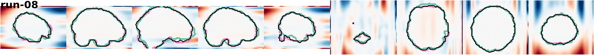

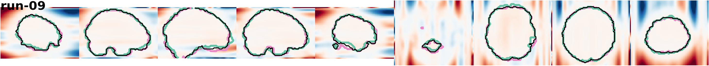

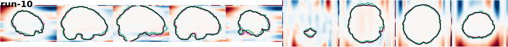

### 20260813T1349:sub-01_ses-09
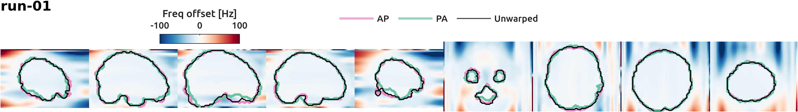

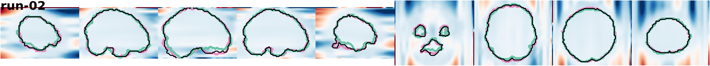

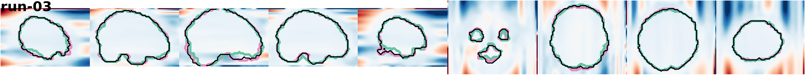

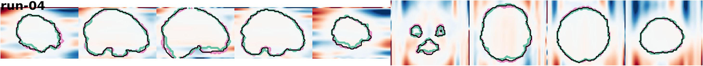

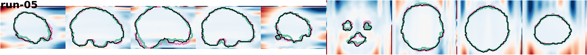

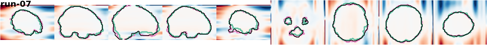

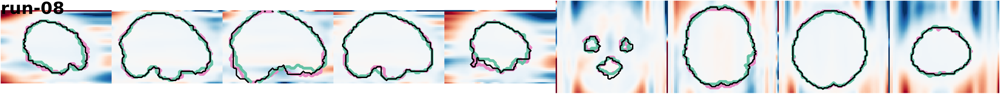

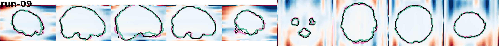

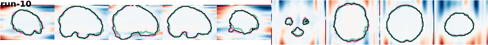

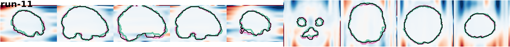

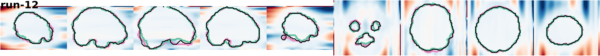

### 20260807T1145:sub-01_ses-08
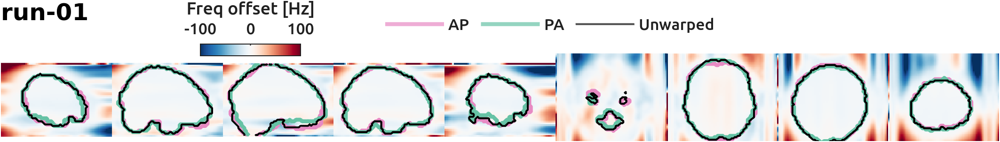

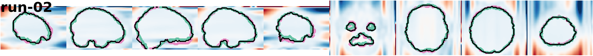

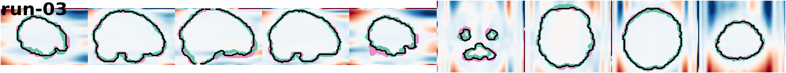

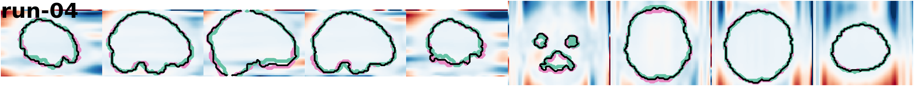

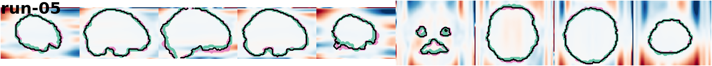

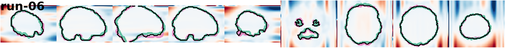

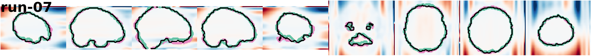

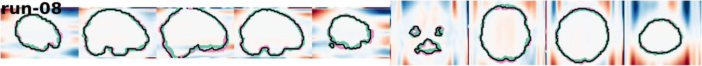

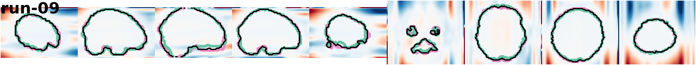

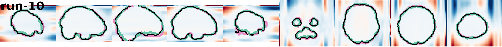

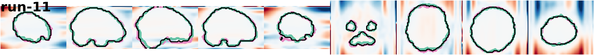

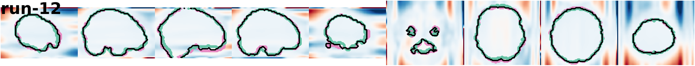

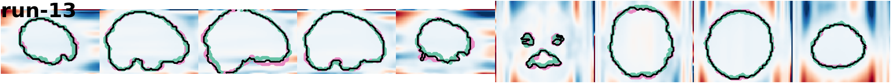

### 20260731T1153:sub-01_ses-07
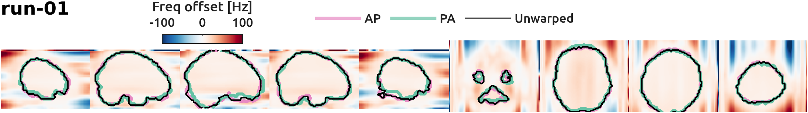

### 20260718T1216:sub-01_ses-06

### 20260703T0952:sub-01_ses-05

### 20260529T0912:sub-01_ses-04

### 20260528T1504:sub-01_ses-03

### 20260522T1216:sub-01_ses-02

### 20260508T1221:sub-01_ses-01

