# topup: sub-10
### 20260829T1206:sub-10_ses-13
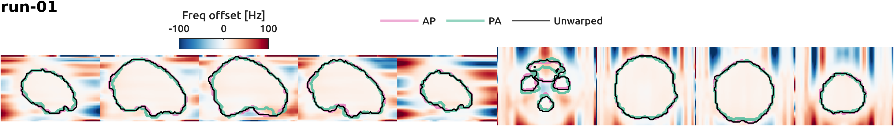

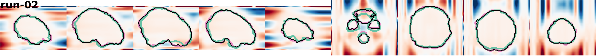

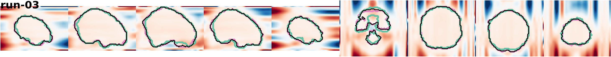

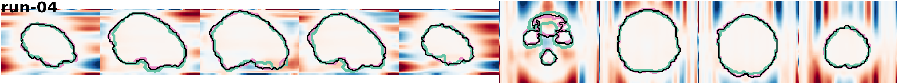

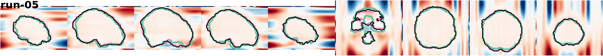

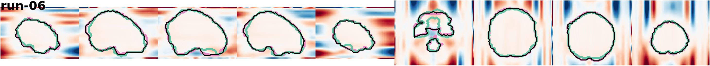

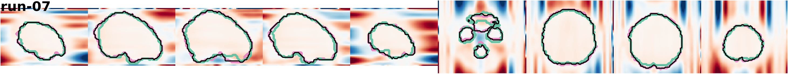

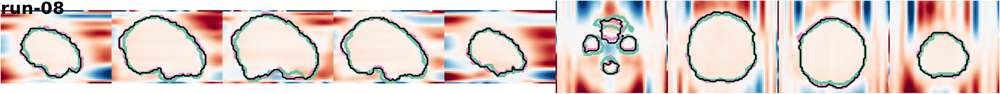

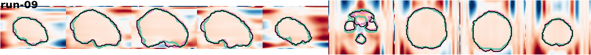

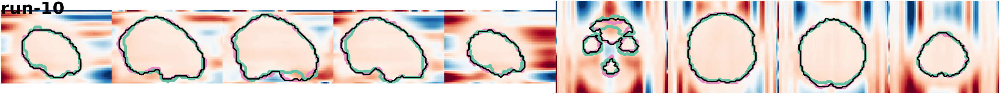

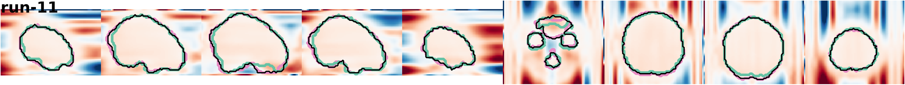

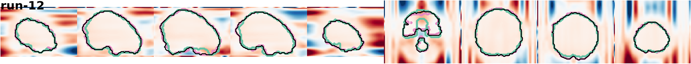

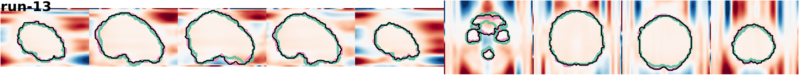

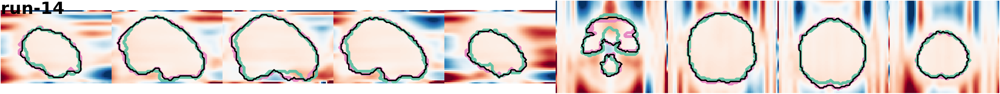

### 20260827T1211:sub-10_ses-12
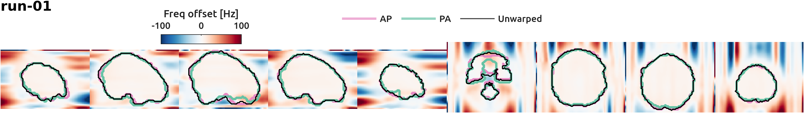

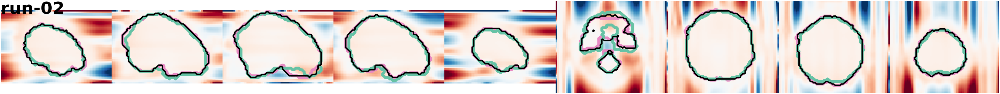

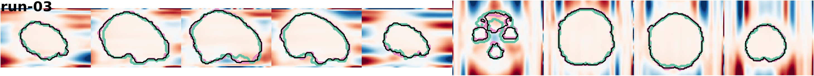

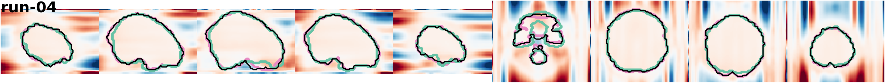

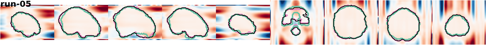

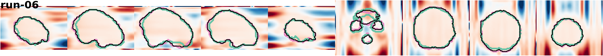

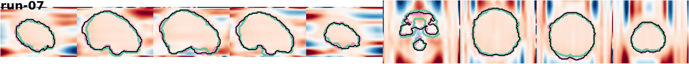

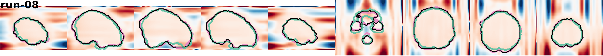

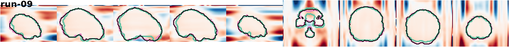

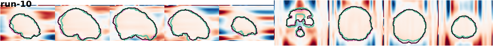

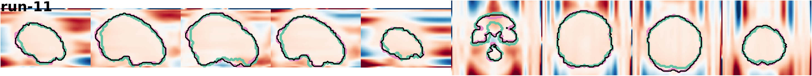

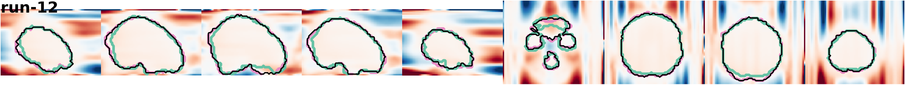

### 20260815T0948:sub-10_ses-11
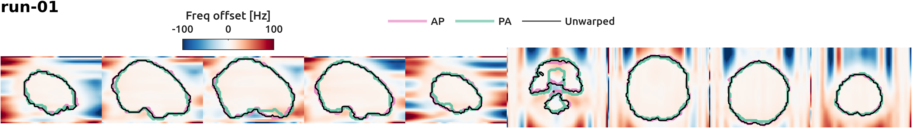

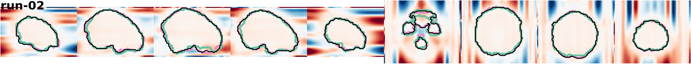

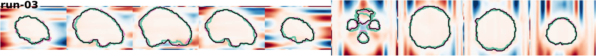

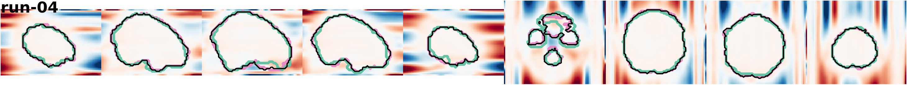

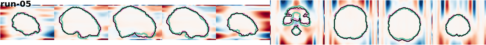

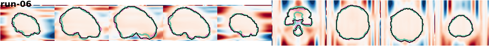

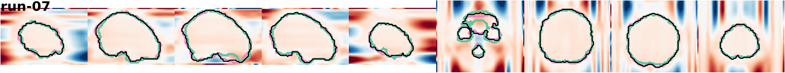

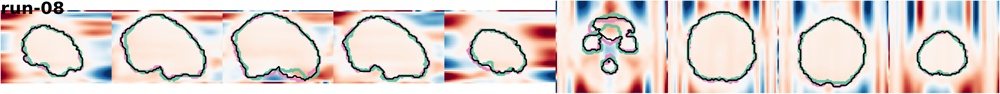

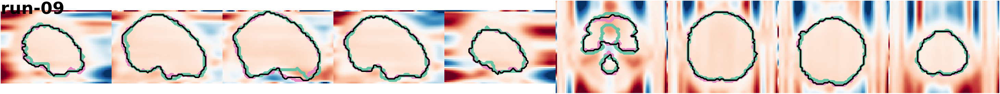

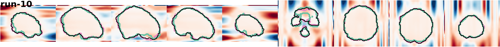

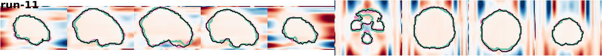

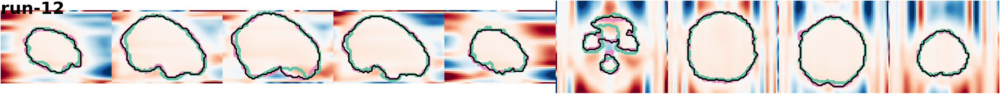

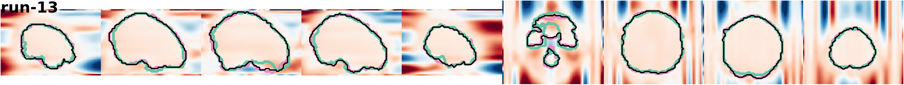

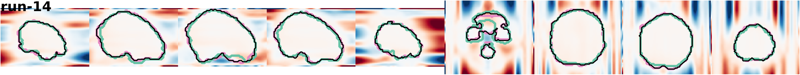

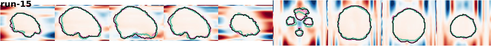

### 20260813T1200:sub-10_ses-10
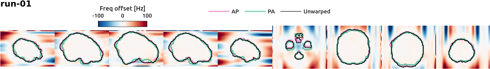

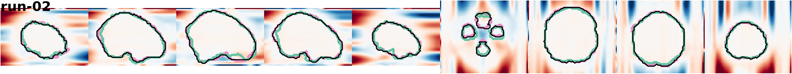

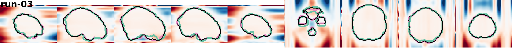

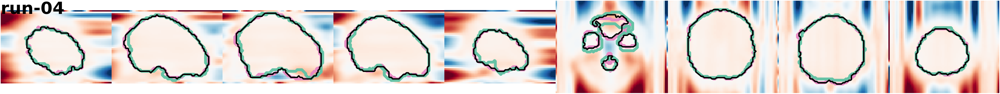

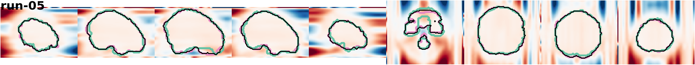

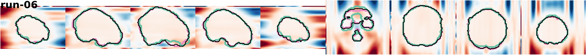

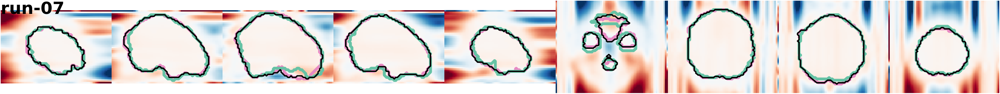

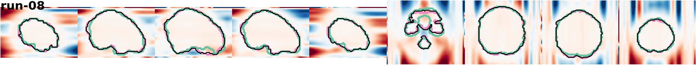

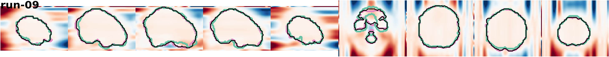

### 20260806T1156:sub-10_ses-09

### 20260716T1220:sub-10_ses-08

### 20260708T0938:sub-10_ses-07

### 20260702T1153:sub-10_ses-06

### 20260611T1226:sub-10_ses-05

### 20260528T1211:sub-10_ses-04

### 20260521T1159:sub-10_ses-03

### 20260511T1249:sub-10_ses-02

### 20260507T1204:sub-10_ses-01

