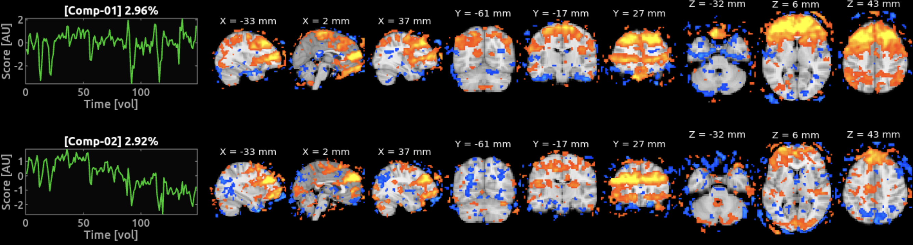
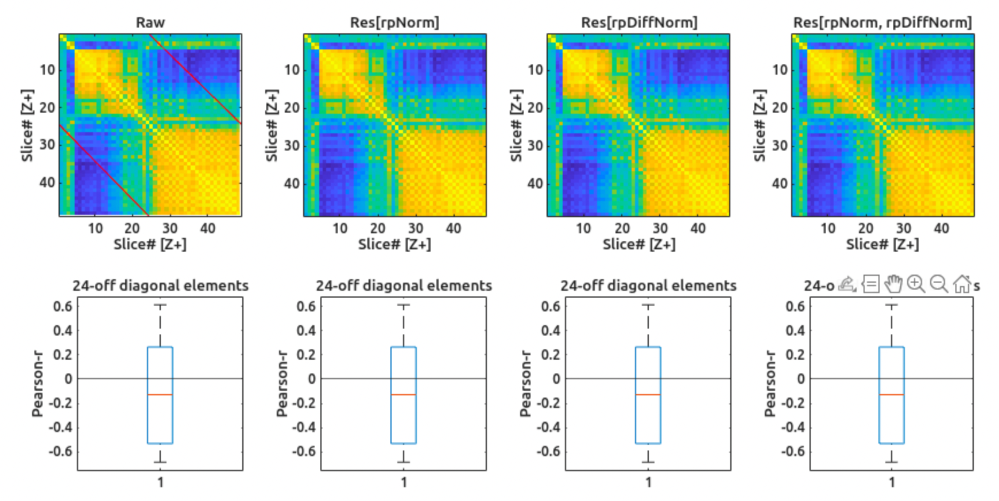

# Repair-on-the-fly🛠️✈️

I would like to start with the Ship of Theseus paradox🛳️⚖️: *if you replace every single part of a ship, is it still the same ship?* And I want to take it to the next level. *If you replace every single part of a ship during the sailing, is it still the same ship?* What about an airplane? *If you replace every single part of an airplane during the flight, is it still the same airplane?* 🤔

In this page, I will document the repairs made on-the-fly, during the data collection. All issues found are documented here, along with the fixes applied. This is to ensure transparency and traceability of the data collection process. And also I think all technical issues are scary👻 at first but hilarious😂 once you understand them. So, enjoy the read! 😄

## Temporal cropping before ICA denoising 🎬
Updated: 2026-08-20

Because of our design of varying durations of runs, some EPI volumes were collected after the fixation cross offset (which happens 12 seconds after the music offset), which are not relevant to the analysis. And because the music listening was followed by button-press responses, the EPI volumes after the fixation cross offset are likely to contain motion artifacts. Highly contaminated time points can negatively affect the ICA algorithm (i.e., FSL's MELODIC).


## Slice leakage 💦
Updated: 2026-08-20

It feels doomed to see slice leakage in the data when using the multiband (MB) sequence. (This also reminds me of the only thing I learned from majoring in economics at university—*There ain't no free lunch*. A more insightful lesson, however, would be to realise that there are people who strongly believe in this mantra.) We are using the state-of-the-art MB sequence developed by the Minnesota group (i.e. CMRR). We configured the parameters for this particular scanner together with an MR physicist and tested the sequence on human participants multiple times. We did not observe any obvious signal leakage in the GLM $t$-statistic maps when using Belin's voice localiser.

However, I found the infamous "zebra patterns" (2 stipes angled as the acquisition slices) from the MELODIC IC maps that explain the quite a bit of variance in the data. Their temporal modes look highly spiky, which suggests that they might be related to head motion. This example is from `sub-01_ses-11_run-01`:



Inspired by [MARSS](https://doi.org/10.1002/hbm.70066), I looked at the slice-by-slice correlation matrices of the raw data. Surprisingly, the runs that showed the zebra patterns in the IC maps did not show the typical off-diagonal patterns (i.e., parallel lines corresponding the simultaneously acquired slices) in the slice-by-slice correlation matrices. 



This suggests that the zebra patterns may be not caused by the slice leakage, but rather by the head motion. The spiky temporal modes of the ICs also support this hypothesis. But then what explains the zebra patterns? 🤨


## Why does the headless MATLAB create a wrong figure? 🙈
Updated: 2026-08-10

I managed to set up a CRON job to run preprocessing as soon as new data comes in to the HPC. CRON gets the preprocessing done. But a small problem was that the headless MATLAB created figures slightly weirdly (wrong proportion; wrong font size...). `GPT` suggested multiple options of which none worked (e.g., changing MATLAB start up options or manually forcing figure properties). `Claude` suggested to use XDisplay (`Xvfb`)to virtually put a head on the CRON job, which worked perfectly. (We really need an Anthropic subscription instead of the Open AI one...)

Basically, in the SBATCH script, you need to wrap the line where it runs a MATLAB script with the `Xvfb` commands (and related bunch) like this:

```
# Open a virtual display for MATLAB to run in headless mode
mkdir -p /tmp/.X11-unix
chmod 1777 /tmp/.X11-unix 2>/dev/null
exec 5>/tmp/xvfb_disp_${SLURM_JOB_ID}
Xvfb -displayfd 5 -screen 0 1920x1080x24 -nolisten unix -listen tcp &
XVFB_PID=$!
sleep 1                 
DISP=$(cat /tmp/xvfb_disp_${SLURM_JOB_ID})
export DISPLAY=localhost:${DISP}

# Run the MATLAB script
matlab -batch "/ABS/PATH/TO/MATLAB/SCRIPT.m"

# Clean up the virtual display
kill ${XVFB_PID}
rm -f /tmp/xvfb_disp_${SLURM_JOB_ID}
```

## Why can't I use the scanner? 🥵🔥
Updated: 2026-06-27

Because of the global warming that caused the all-time heat record (41.5 degree Celsius) in Frankfurt for the past week, the cooling system at the CoBIC has been malfunctioning, and all three scanners have been shut down to prevent the need for emergency quenching.


## Why won't the Psychtoolbox proceed after sound playback? ⛔
Updated: 2026-05-15

### What went wrong?

Each run follows by 12 seconds of silence after the sound playback to acquire the slow offset BOLD response. But on that day, the Psychtoolbox script just hangs there and doesn't proceed to the next trial, even after 12 seconds. This happened in early runs of sub-03_ses-02.

### What was the cause?

Because I was using the lowest sampling rate for the EyeLink (250 Hz), the EyeLink data after 5+ minutes run was pretty small and parseable within ~10 seconds. So, I was parsing the EyeLink data after each run while waiting for the 12 seconds.

However, because the Eyelink sampling rate was higher (1000 Hz; see below), the data parsing took much longer with the Claude-generated for-loop-if-continue code. So, I commented all online parsing code, and just copied the original format (`.EDF` not the standard EDF---EyelinkDataFile?). 

Better optimised code (using `split` without for-loop) still took 10+ seconds for 5+ minutes of data.

## Why can the Eyelink never detect the pupil? 👁️‍
Updated: 2026-05-15

### What went wrong?

The EyeLink was never able to detect the pupil during the recording, which is a critical issue for our study. The images from the EyeLink show that the pupil is clearly visible, but the EyeLink software fails to detect it. This happened in early runs of all ses-01.

### What was the cause?

I thought the sampling rate of the EyeLink would trade off between the data quality and the processing speed, so I set it to the lowest (250 Hz) for the better image quality. You know, just like the video game graphics🕹️, the lower the frame rate, the better the image quality. Also, that's how a digital video camera works! 

However, that was not the case for the EyeLink. The low sampling rate of the EyeLink seems to have caused missed detections of the pupil. (Still unclear though because the lighting conditions are not really changing in the scanner room, and the gaze was fixated on the center of the screen.)

Actually 1000 Hz resulted in a lot better pupil detection. This dramatically improved the pupil detection, and we were able to get usable eye-tracking data for the rest of the sessions.

## Who is corrupting my MATLAB binary files? 👻
Updated: 2026-05-11

### What went wrong?

Because now I have to use the isolated Windows computer to run the PsychToolBox, I use a USB drive to temporarily store files to upload them to the private Github server. However, often I experienced that the MATLAB binary files (`.mat`) got corrupted after uploading.

### What was the cause?

It turns out that it was GIT automatically fixing the line endings of the binary files, which is a common issue when using GIT on Windows (because Windows "wrongly" uses CRLF line endings instead of LF😡). To prevent this, I added a `.gitattributes` file to the repository with the following content:

```
*.mat binary
```
